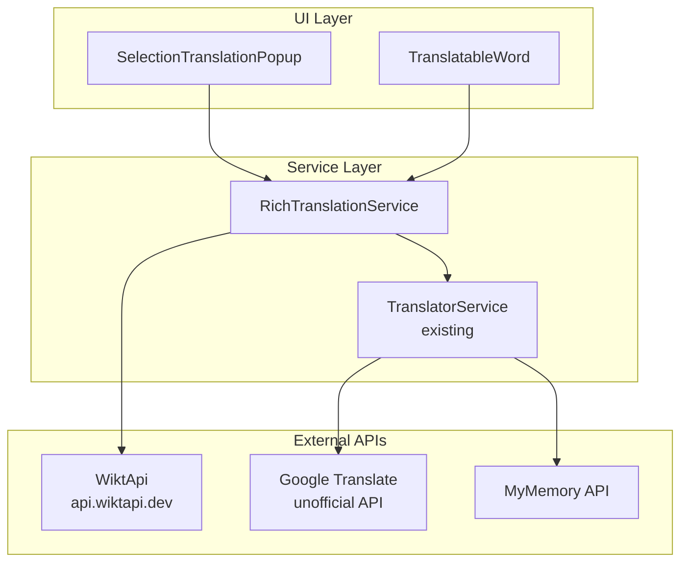
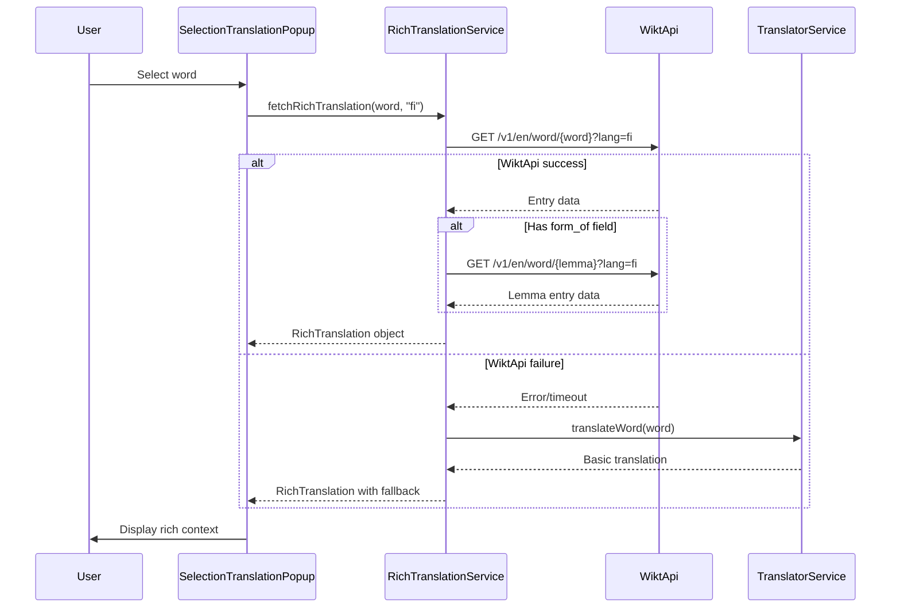
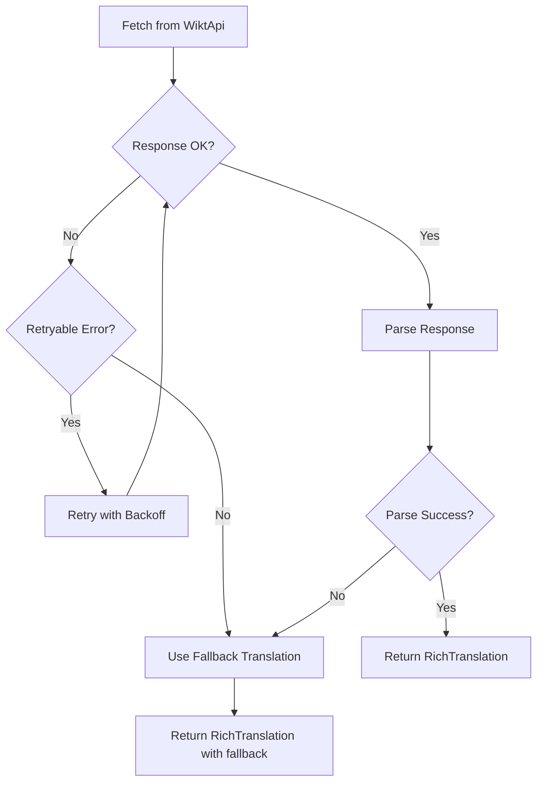

# Design Document: Rich Translation Context

## Overview

This document describes the technical design for enhancing the translation feature in the Finnish language learning app. The current system provides basic word translations via Google Translate's unofficial API. The enhanced system will provide rich linguistic context including base word forms (lemmas), parts of speech, definitions, example sentences, and pronunciation using the WiktApi service.

### Goals

1. Provide comprehensive linguistic context for selected Finnish words
2. Help learners understand inflected word forms by showing the dictionary form (lemma)
3. Enable vocabulary building through definitions and example sentences
4. Support pronunciation learning with IPA notation
5. Maintain graceful fallback to existing translation services
6. Design for future language extensibility

### Non-Goals

- Offline translation support
- User account-based vocabulary persistence
- Audio pronunciation playback (IPA display only)
- Multi-language support in initial implementation (architecture will support it)

## Architecture

### High-Level Architecture



### Data Flow



### Component Responsibilities

| Component | Responsibility |
|-----------|---------------|
| SelectionTranslationPopup | Orchestrates translation requests, displays results |
| TranslatableWord | Handles hover-based translation for individual words |
| RichTranslationService | Fetches and parses WiktApi data, manages fallback |
| TranslatorService | Existing translation service (unchanged) |

## Components and Interfaces

### RichTranslationService

The core service module that orchestrates rich translation fetching.

```typescript
// src/utils/richTranslationService.ts

/**
 * Main entry point for rich translation
 * @param word - The word to translate
 * @param lang - ISO 639-1 language code (e.g., "fi")
 * @returns RichTranslation object with all available data
 */
export async function fetchRichTranslation(
  word: string, 
  lang: string
): Promise<RichTranslation>;

/**
 * Fetches entry data from WiktApi
 * @param word - The word to look up
 * @param lang - Language code
 * @returns Raw WiktApi response or null on failure
 */
async function fetchWiktApiEntry(
  word: string, 
  lang: string
): Promise<WiktApiResponse | null>;

/**
 * Parses WiktApi response into structured RichTranslation
 * @param response - Raw WiktApi response
 * @param originalWord - The originally selected word
 * @returns Parsed RichTranslation object
 */
function parseWiktApiResponse(
  response: WiktApiResponse, 
  originalWord: string
): RichTranslation;

/**
 * Detects if word is inflected form and extracts lemma
 * @param entry - WiktApi entry
 * @returns Lemma word if inflected, null otherwise
 */
function extractLemma(entry: WiktApiEntry): string | null;

/**
 * Creates fallback translation using existing service
 * @param word - Word to translate
 * @param lang - Source language
 * @returns RichTranslation with basic translation only
 */
async function createFallbackTranslation(
  word: string, 
  lang: string
): Promise<RichTranslation>;
```

### WiktApi Client

Handles direct communication with the WiktApi service.

```typescript
// src/utils/wiktApiClient.ts

const WIKTAPI_BASE_URL = 'https://api.wiktapi.dev/v1/en/word';
const WIKTAPI_TIMEOUT_MS = 5000;

interface WiktApiClientConfig {
  baseUrl: string;
  timeout: number;
}

/**
 * Fetches word entry from WiktApi
 */
async function fetchWordEntry(
  word: string, 
  lang: string, 
  config?: Partial<WiktApiClientConfig>
): Promise<WiktApiResponse | null>;

/**
 * Fetches definitions only (lighter weight)
 */
async function fetchDefinitions(
  word: string, 
  lang: string
): Promise<WiktApiDefinition[] | null>;
```

### Response Parser

Transforms WiktApi responses into internal data structures.

```typescript
// src/utils/wiktApiParser.ts

/**
 * Parses full WiktApi response into RichTranslation
 */
function parseResponse(response: WiktApiResponse, originalWord: string): RichTranslation;

/**
 * Extracts part of speech from entry
 */
function extractPartOfSpeech(entry: WiktApiEntry): PartOfSpeech | null;

/**
 * Extracts definitions with examples
 */
function extractDefinitions(entry: WiktApiEntry): Definition[];

/**
 * Extracts IPA pronunciation
 */
function extractPronunciation(entry: WiktApiEntry): string | null;

/**
 * Extracts grammatical tags (case, number, etc.)
 */
function extractGrammaticalTags(sense: WiktApiSense): string[];
```

## Data Models

### Core Types

```typescript
// src/types/richTranslation.ts

/**
 * Main data structure for rich translation results
 */
interface RichTranslation {
  /** The originally selected word */
  word: string;
  
  /** ISO 639-1 language code */
  language: string;
  
  /** Base word (lemma) if word is inflected form */
  lemma: string | null;
  
  /** Grammatical relationship description (e.g., "inessive singular") */
  grammaticalForm: string | null;
  
  /** Part of speech */
  partOfSpeech: PartOfSpeech | null;
  
  /** Definitions with optional examples */
  definitions: Definition[];
  
  /** IPA pronunciation notation */
  pronunciation: string | null;
  
  /** Basic translation from fallback service */
  fallbackTranslation: string | null;
  
  /** Source of the translation data */
  source: 'wiktapi' | 'fallback';
  
  /** Timestamp of fetch */
  fetchedAt: string;
}

type PartOfSpeech = 
  | 'noun'
  | 'verb'
  | 'adjective'
  | 'adverb'
  | 'pronoun'
  | 'preposition'
  | 'conjunction'
  | 'interjection'
  | 'numeral'
  | 'particle';

interface Definition {
  /** Definition text */
  text: string;
  
  /** Example sentences (optional) */
  examples: Example[];
}

interface Example {
  /** Example sentence in target language */
  text: string;
  
  /** English translation of example */
  translation: string | null;
}
```

### WiktApi Response Types

```typescript
// src/types/wiktApi.ts

/**
 * Full WiktApi response structure
 */
interface WiktApiResponse {
  word: string;
  entries: WiktApiEntry[];
}

interface WiktApiEntry {
  /** Part of speech code */
  pos?: string;
  
  /** Word senses (definitions) */
  senses: WiktApiSense[];
  
  /** Pronunciation data */
  sounds?: WiktApiSound[];
  
  /** Inflected forms */
  forms?: WiktApiForm[];
}

interface WiktApiSense {
  /** Definition glosses */
  glosses?: string[];
  
  /** Example sentences */
  examples?: WiktApiExample[];
  
  /** Indicates this is inflected form of another word */
  form_of?: WiktApiFormOf[];
  
  /** Grammatical tags */
  tags?: string[];
}

interface WiktApiSound {
  /** IPA notation */
  ipa?: string;
  
  /** Audio file URL */
  audio?: string;
}

interface WiktApiForm {
  /** Inflected form */
  form: string;
  
  /** Grammatical tags for this form */
  tags?: string[];
}

interface WiktApiFormOf {
  /** Base word (lemma) */
  word: string;
}

interface WiktApiExample {
  /** Example sentence */
  text: string;
  
  /** English translation */
  translation?: string;
}
```

### Part of Speech Mapping

```typescript
// src/utils/partOfSpeechMap.ts

/**
 * Maps WiktApi POS codes to human-readable labels
 */
const POS_MAPPING: Record<string, PartOfSpeech> = {
  'n': 'noun',
  'noun': 'noun',
  'v': 'verb',
  'verb': 'verb',
  'adj': 'adjective',
  'adjective': 'adjective',
  'adv': 'adverb',
  'adverb': 'adverb',
  'pron': 'pronoun',
  'pronoun': 'pronoun',
  'prep': 'preposition',
  'preposition': 'preposition',
  'conj': 'conjunction',
  'conjunction': 'conjunction',
  'intj': 'interjection',
  'interjection': 'interjection',
  'num': 'numeral',
  'numeral': 'numeral',
  'particle': 'particle',
};

function mapPartOfSpeech(posCode: string): PartOfSpeech | null;
```

### Grammatical Tag Display

```typescript
// src/utils/grammaticalTags.ts

/**
 * Maps grammatical tags to display labels
 */
const TAG_DISPLAY: Record<string, string> = {
  // Cases
  'nominative': 'nominative',
  'genitive': 'genitive',
  'partitive': 'partitive',
  'inessive': 'inessive',
  'elative': 'elative',
  'illative': 'illative',
  'adessive': 'adessive',
  'ablative': 'ablative',
  'allative': 'allative',
  
  // Number
  'singular': 'singular',
  'plural': 'plural',
  
  // Tense
  'present': 'present',
  'past': 'past',
  
  // Mood
  'indicative': 'indicative',
  'conditional': 'conditional',
  'imperative': 'imperative',
  
  // Voice
  'active': 'active',
  'passive': 'passive',
};

/**
 * Formats grammatical tags into display string
 * @param tags - Array of grammatical tags
 * @returns Formatted string (e.g., "inessive singular")
 */
function formatGrammaticalTags(tags: string[]): string;
```
## Correctness Properties

*A property is a characteristic or behavior that should hold true across all valid executions of a system-essentially, a formal statement about what the system should do. Properties serve as the bridge between human-readable specifications and machine-verifiable correctness guarantees.*

### Property 1: URL Construction

*For any* word string and language code, the WiktApi URL constructor SHALL produce a URL matching the pattern `https://api.wiktapi.dev/v1/en/word/{word}?lang={lang}` where `{word}` is the URL-encoded word and `{lang}` is the provided language code.

**Validates: Requirements 1.5, 9.2**

### Property 2: Valid Response Parsing

*For any* valid WiktApi JSON response, the parser SHALL extract and return a RichTranslation object containing all available fields: lemma (if form_of exists), partOfSpeech (if pos exists), definitions (from glosses), examples (from sense examples), and pronunciation (from sounds IPA).

**Validates: Requirements 1.2, 11.1, 11.3**

### Property 3: Lemma Extraction

*For any* WiktApi entry containing a `form_of` field, the parser SHALL extract the lemma word from the first `form_of` item. *For any* WiktApi entry without a `form_of` field, the lemma field SHALL be null.

**Validates: Requirements 1.3, 2.2**

### Property 4: Part of Speech Mapping

*For any* valid WiktApi POS code, the mapper SHALL return the corresponding PartOfSpeech label. *For any* unknown or missing POS code, the result SHALL be null.

**Validates: Requirements 3.1, 3.2, 3.3**

### Property 5: Definition Limiting and Formatting

*For any* WiktApi sense with glosses, the parser SHALL return at most 3 definitions, numbered sequentially starting from 1. *For any* WiktApi sense without glosses, the definitions array SHALL be empty.

**Validates: Requirements 4.1, 4.2**

### Property 6: Example Handling

*For any* WiktApi sense with examples, the parser SHALL return at most 2 examples. *For any* WiktApi sense without examples, the examples array SHALL be empty.

**Validates: Requirements 5.1, 5.3**

### Property 7: Pronunciation Formatting

*For any* WiktApi entry with sounds containing IPA, the parser SHALL return the first IPA value enclosed in square brackets. *For any* WiktApi entry without IPA sounds, the pronunciation field SHALL be null.

**Validates: Requirements 6.1, 6.2, 6.3, 6.4**

### Property 8: Grammatical Tag Formatting

*For any* array of grammatical tags, the formatter SHALL produce a display string with tags mapped to human-readable labels and joined in a consistent order.

**Validates: Requirements 2.3**

### Property 9: Fallback on Error

*For any* WiktApi error response (HTTP 4xx, 5xx, or network error), the service SHALL return a RichTranslation with `source: 'fallback'` and the fallbackTranslation field populated.

**Validates: Requirements 7.2, 7.3**

### Property 10: Invalid Response Handling

*For any* malformed or invalid WiktApi JSON response, the parser SHALL throw a descriptive error indicating the parsing failure.

**Validates: Requirements 11.2**

### Property 11: Round-Trip Data Integrity

*For any* valid RichTranslation object, serializing to JSON then parsing back SHALL produce an equivalent object with all fields preserved, including optional fields (examples, pronunciation).

**Validates: Requirements 12.1, 12.2, 12.3**

## Error Handling

### Error Categories

| Category | Example | Handling Strategy |
|----------|---------|-------------------|
| Network Error | Connection timeout, DNS failure | Fall back to Google Translate |
| API Error | HTTP 4xx, 5xx from WiktApi | Fall back to Google Translate |
| Parse Error | Malformed JSON response | Log error, fall back to Google Translate |
| Missing Data | No definitions found | Display available data, use fallback for translation |
| Rate Limiting | Too many requests | Fall back to Google Translate |

### Error Handling Flow



### Fallback Strategy

1. **Primary**: WiktApi for rich linguistic data
2. **Secondary**: Google Translate unofficial API for basic translation
3. **Tertiary**: MyMemory API (existing fallback chain)

### Error Logging

All errors are logged to the browser console with structured information:

```typescript
interface TranslationError {
  timestamp: string;
  word: string;
  language: string;
  errorType: 'network' | 'api' | 'parse' | 'timeout';
  message: string;
  stack?: string;
}
```

### User-Facing Error Messages

| Scenario | User Message |
|----------|--------------|
| WiktApi unavailable | Show basic translation (no rich context) |
| All services fail | "Translation temporarily unavailable" |
| Selection too long | "Selected text is too long to translate" |

## Testing Strategy

### Dual Testing Approach

This feature requires both unit tests and property-based tests for comprehensive coverage:

- **Unit tests**: Verify specific examples, edge cases, and error conditions
- **Property tests**: Verify universal properties across all inputs

### Property-Based Testing

**Library**: fast-check (JavaScript/TypeScript property-based testing)

**Configuration**:
- Minimum 100 iterations per property test
- Each test tagged with design property reference

### Test Organization

```
src/__tests__/
├── utils/
│   ├── richTranslationService.test.ts
│   ├── wiktApiClient.test.ts
│   └── wiktApiParser.test.ts
└── types/
    └── richTranslation.roundtrip.test.ts
```

### Property Test Specifications

#### Property 1: URL Construction
```typescript
// Feature: rich-translation-context, Property 1: URL Construction
test('URL construction follows WiktApi format', () => {
  fc.assert(
    fc.property(
      fc.string({ minLength: 1, maxLength: 50 }),
      fc.string({ minLength: 2, maxLength: 5 }),
      (word, lang) => {
        const url = constructWiktApiUrl(word, lang);
        expect(url).toMatch(/^https:\/\/api\.wiktapi\.dev\/v1\/en\/word\/.+$/);
        expect(url).toContain(`lang=${lang}`);
      }
    ),
    { numRuns: 100 }
  );
});
```

#### Property 2: Valid Response Parsing
```typescript
// Feature: rich-translation-context, Property 2: Valid Response Parsing
test('parser extracts all available fields from valid response', () => {
  fc.assert(
    fc.property(wiktApiResponseArbitrary(), (response) => {
      const result = parseWiktApiResponse(response, response.word);
      expect(result).toBeDefined();
      expect(result.word).toBe(response.word);
      // Verify all fields are extracted when present in source
    }),
    { numRuns: 100 }
  );
});
```

#### Property 11: Round-Trip Data Integrity
```typescript
// Feature: rich-translation-context, Property 11: Round-Trip Data Integrity
test('RichTranslation round-trips through JSON serialization', () => {
  fc.assert(
    fc.property(richTranslationArbitrary(), (original) => {
      const serialized = JSON.stringify(original);
      const parsed = JSON.parse(serialized) as RichTranslation;
      expect(parsed).toEqual(original);
    }),
    { numRuns: 100 }
  );
});
```

### Unit Test Coverage

| Component | Test Focus |
|-----------|------------|
| RichTranslationService | Fallback behavior, timeout handling |
| WiktApiClient | HTTP error responses, network failures |
| WiktApiParser | Edge cases (empty responses, missing fields) |
| Part of Speech Mapper | All known POS codes, unknown codes |
| Grammatical Tags | All Finnish cases, formatting |

### Test Data Generators

```typescript
// Custom arbitraries for property-based testing
const wiktApiResponseArbitrary = () => fc.record({
  word: fc.string(),
  entries: fc.array(wiktApiEntryArbitrary())
});

const wiktApiEntryArbitrary = () => fc.record({
  pos: fc.optional(fc.string()),
  senses: fc.array(wiktApiSenseArbitrary()),
  sounds: fc.optional(fc.array(wiktApiSoundArbitrary())),
  forms: fc.optional(fc.array(wiktApiFormArbitrary()))
});

const richTranslationArbitrary = () => fc.record({
  word: fc.string(),
  language: fc.string({ minLength: 2, maxLength: 5 }),
  lemma: fc.optional(fc.string()),
  grammaticalForm: fc.optional(fc.string()),
  partOfSpeech: fc.optional(partOfSpeechArbitrary()),
  definitions: fc.array(definitionArbitrary()),
  pronunciation: fc.optional(fc.string()),
  fallbackTranslation: fc.optional(fc.string()),
  source: fc.constantFrom('wiktapi', 'fallback'),
  fetchedAt: fc.dateString()
});
```

### Integration Testing

Manual integration tests will verify:
1. End-to-end flow from word selection to UI display
2. Actual WiktApi responses for common Finnish words
3. Fallback behavior when WiktApi is unavailable
4. UI responsiveness on mobile and desktop viewports