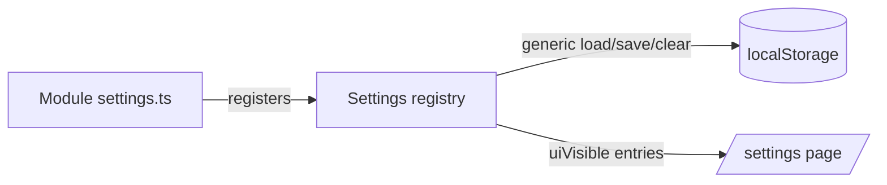

## Description

- **Problem:** settings are scattered per-module — [translation/settings.ts](../../src/modules/translation/settings.ts)
  and [vocab-test/settings.ts](../../src/modules/vocab-test/settings.ts) each duplicate the same
  localStorage load/save/parse boilerplate, each has its own hand-built panel component, and
  [app/settings/page.tsx](../../src/app/settings/page.tsx) manually stacks them. Adding a settings
  group today means touching 3 places; there's no shared idea of "user-facing" vs "code-only" setting.
- **Goal:** one place (per module) to register a setting — key, default, validator, `uiVisible` flag,
  label — so any setting *can* be surfaced in the Settings UI later without re-plumbing, even if most
  stay code-only for now.

- **Approach (sketch — refine in Log):**
  - Shared registry: each module keeps owning its value types, but registers them centrally
    (key, validator, default, `uiVisible: boolean`, label/description).
  - One generic persistence helper (load/save/clear) replacing the repeated localStorage code.
  - Settings page renders from the registry's `uiVisible` entries; whether existing bespoke panels
    (drag-reorder source list, preset picker) stay hand-built or go generic is an open call — decide
    during implementation, either way wired through the registry.
- **Constraints:** localStorage only (no backend/DB, per existing pattern); must not regress
  task-011 (SRS tuning) or task-013 (translation source order) — both already ship working UI.

## Plan
- [ ] Inventory current + likely-near-future settings groups (translation order, SRS tuning; note
      candidates like quiz session mechanics, notification prefs)
- [ ] Design registry shape + generic persistence helper
- [ ] Decide: generic UI controls vs. keep bespoke panels for the two complex existing ones
- [ ] Migrate the two existing settings groups onto the registry (no behaviour change)
- [ ] Update the settings page to render from the registry
- [ ] Verify existing settings still load/save/persist correctly (manual browser check)

## Done when

A new module can add a setting by registering it in one place; showing it in the Settings UI is a
single flag on that registration, not separate plumbing. The two existing settings groups
(translation order, SRS tuning) work unchanged after migrating onto the new system.

## Log
- 2026-07-18: Drafted [human + ai]. Scattered settings (translation order, SRS tuning) each
  duplicate localStorage boilerplate + a bespoke panel; no shared "code-only vs UI-visible"
  concept. Leading idea: a per-module settings registry + generic persistence, with a `uiVisible`
  flag per setting so anything can be exposed later without rework. Open question for
  implementation: keep bespoke panels for the two existing complex UIs, or go fully generic.
