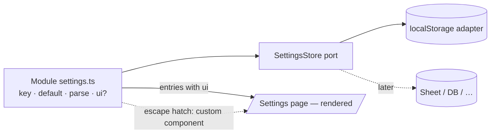

## Description

- **Problem:** personalizable choices get buried in code. A value that suits one reader
  (session size, how fast the SRS spaces words, which translator is tried first) doesn't suit
  another, but today exposing one means hand-building a panel and hand-stacking it into
  [app/settings/page.tsx](../../src/app/settings/page.tsx) — so it usually stays hardcoded.
  Separately, the three settings groups that *do* exist
  ([translation/settings.ts](../../src/modules/translation/settings.ts),
  [vocab-test/settings.ts](../../src/modules/vocab-test/settings.ts),
  [vocab-store/sheetSettings.ts](../../src/modules/vocab-store/sheetSettings.ts)) each duplicate
  the same localStorage load/save/parse boilerplate.
- **Goal:** the Settings page is **generated** from the settings declarations. Adding a
  personalizable setting = declaring it once in its module; it appears in the UI with no page
  edit and no new panel.
- **Not in scope — session state.** [reader/storage.ts](../../src/modules/reader/storage.ts),
  [session-history/storage.ts](../../src/modules/session-history/storage.ts),
  [vocab-store/vocabStorage.ts](../../src/modules/vocab-store/vocabStorage.ts) share the same
  localStorage boilerplate but are *state* (scroll position, lookup history), not user settings.
  They may reuse the persistence helper; they never appear in the Settings UI.

- **Approach (sketch — refine in Log):**
  - One declaration per setting: `key`, `default`, `parse`, and an optional
    `ui: { label, description, control }`. **Presence of `ui` is what makes it user-facing** —
    no separate `uiVisible` flag, no registration call. Omit `ui` → code-only.
  - Persistence sits behind a **`SettingsStore` port** (load/save/clear + parse-or-default),
    with a localStorage adapter as the only implementation for now — a Sheet- or DB-backed one
    must be a drop-in later. Follows the existing
    [VocabRepository](../../src/modules/vocab-store/ports/VocabRepository.ts) pattern, **including
    its async signature**: that port returns Promises even though
    [its localStorage adapter](../../src/modules/vocab-store/adapters/LocalStorageVocabRepository.ts)
    is synchronous, precisely so a remote adapter can drop in without touching call sites. A sync
    port here would make the separation nominal only.
  - Async has a cost to settle in implementation: a few call sites read settings synchronously
    (`tuningHeader()` in [vocab-test/client.ts](../../src/modules/vocab-test/client.ts),
    [richTranslationService.ts](../../src/modules/translation/services/richTranslationService.ts)).
    Likely answer: hydrate an in-memory cache once at startup so reads stay sync while
    load/save/clear go through the async port — decide during implementation.
  - Settings page iterates the declarations and renders each group as a section. Generic controls
    are the default path; a group may supply its own component as an **escape hatch** where a
    generic control can't express it (drag-reorder source list, SRS preset picker).
  - Modules keep owning their value types and validators — the helper is generic over them.
- **Constraints:** localStorage is the only adapter shipped now — but behind the port, not assumed
  by callers (no direct `localStorage` outside the adapter); must not regress
  [[task-011_expose-srs-tuning-config]] (SRS tuning) or
  [[task-013_configurable-translation-source-order]] (translation source order) — both ship
  working UI today; imports need explicit `.ts` extensions (Node's test runner rejects the
  extensionless form — see [[task-019_centralized-app-config]] Log).

## Plan
- [ ] Inventory the three groups + the control kinds they need (number, enum/preset, ordered
      list, text), and note near-future candidates (quiz session mechanics, reader preferences)
- [ ] Design the declaration shape + the `SettingsStore` port (async, per VocabRepository)
- [ ] Settle sync-read call sites (in-memory cache hydrated at startup, or make them async)
- [ ] Decide which control kinds are worth generic components vs. left to the escape hatch
- [ ] Migrate the three groups onto it (no behaviour change)
- [ ] Make the settings page render from the declarations
- [ ] Verify: `node:test` units for the port's parse/default paths against an in-memory fake
      adapter (proves the seam holds without a browser); manual browser check for the panel UIs

## Done when

Adding a personalizable setting means writing one declaration in its module — it then persists and
appears on the Settings page without touching the page or writing a panel. The three existing
groups (translation order, SRS tuning, vocab sheet) work unchanged after migrating onto it.
Swapping localStorage for a Sheet/DB store means writing one new adapter — no module's settings
code and no call site changes.

## Log
- 2026-07-20: Persistence must stay swappable [human + ai]. Human: the store has to be replaceable
  by a DB/Sheet later — "keep the separation properly". Reshaped the generic helper into a
  `SettingsStore` **port** with a localStorage adapter, matching the module pattern already used
  across the codebase (VocabRepository, MorphologyAnalyzer, Translator, …). The load-bearing detail
  is the **async signature**: `VocabRepository` already returns Promises while its localStorage
  adapter is sync (`Promise.resolve` wrappers) — copying that means a remote adapter drops in
  without touching callers, whereas a sync port would have to be rewritten at every call site the
  day a Sheet-backed store arrives, making the separation nominal. Cost identified: three call
  sites read settings synchronously today (`tuningHeader()`, `richTranslationService`); leading
  answer is an in-memory cache hydrated at startup, deferred to implementation. Constraint reworded
  from "localStorage only" to "localStorage is the only adapter, behind the port".
- 2026-07-20: Revised after reviewing [[task-019_centralized-app-config]]'s outcome [human + ai].
  Three changes. **(1) Scope:** found a third group with the identical shape —
  `vocab-store/sheetSettings.ts` — human agreed to include it; migrating three groups tests the
  abstraction better than two. Also wrote the settings-vs-session-state boundary into the
  Description, since "duplicated localStorage boilerplate" as a problem statement would otherwise
  sweep in reader/session-history/vocab storage. **(2) Weight:** task-019 landed as plain object
  literals after the human twice pushed back on ceremony (getters → eager objects; deleted the
  `vocabSavingFlag` wrappers as "a facade wrapped in a same-shaped function"). Human chose to match
  that minimalism here. **(3) Reframed by a new requirement from the human:** the point isn't
  removing plumbing, it's that *users ask for changes that shouldn't apply to everyone* — so the
  fix is a Settings page **generated** from the declarations, not a hand-built one. That reverses
  the earlier "keep bespoke panels" leaning (generic-first now, bespoke as escape hatch) and
  un-defers UI metadata, which the minimalism choice had put off. Reconciled by dropping the
  `uiVisible` boolean and the registry-entry/registration ceremony: a setting carries an optional
  `ui` block, and its presence alone makes the setting user-facing. **Also settled:** task-019's
  open question of whether config and settings want a shared primitive — no. Both are too small to
  share anything (`config.server.ts` is 15 lines), and settings adds mutability, validation of
  untrusted stored values, and UI that config has no use for.
- 2026-07-18: Drafted [human + ai]. Scattered settings (translation order, SRS tuning) each
  duplicate localStorage boilerplate + a bespoke panel; no shared "code-only vs UI-visible"
  concept. Leading idea: a per-module settings registry + generic persistence, with a `uiVisible`
  flag per setting so anything can be exposed later without rework. Open question for
  implementation: keep bespoke panels for the two existing complex UIs, or go fully generic.
