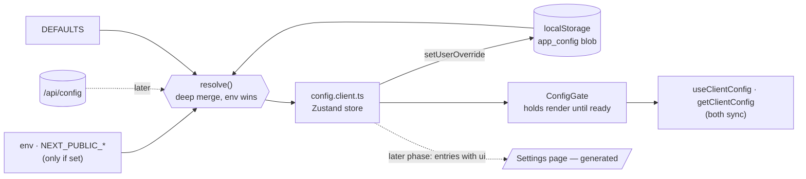

## Description

- **Problem:** personalizable choices get buried in code. A value that suits one reader
  (session size, how fast the SRS spaces words, which translator is tried first) doesn't suit
  another, but today exposing one means hand-building a panel and hand-stacking it into
  [app/settings/page.tsx](../../src/app/settings/page.tsx) — so it usually stays hardcoded.
  Separately, the three settings groups that *do* exist
  ([translation/settings.ts](../../src/modules/translation/settings.ts),
  [vocab-test/settings.ts](../../src/modules/vocab-test/settings.ts),
  [vocab-store/sheetSettings.ts](../../src/modules/vocab-store/sheetSettings.ts)) each duplicate
  the same localStorage load/save/parse boilerplate.
- **Goal:** the Settings page is **generated** from the settings declarations. Adding a
  personalizable setting = declaring it once in its module; it appears in the UI with no page
  edit and no new panel.
- **Not in scope — session state.** [reader/storage.ts](../../src/modules/reader/storage.ts),
  [session-history/storage.ts](../../src/modules/session-history/storage.ts),
  [vocab-store/vocabStorage.ts](../../src/modules/vocab-store/vocabStorage.ts) share the same
  localStorage boilerplate but are *state* (scroll position, lookup history), not user settings.
  They may reuse the persistence helper; they never appear in the Settings UI.


```mermaid
flowchart LR
  ENV["env · NEXT_PUBLIC_*<br/>(only if set)"] --> R{{"resolve()<br/>deep merge, env wins"}}
  LS[("localStorage<br/>app_config blob")] --> R
  API[("/api/config")] -. later .-> R
  DEF[DEFAULTS] --> R
  R --> S["config.client.ts<br/>Zustand store"]
  S --> G["ConfigGate<br/>holds render until ready"]
  G --> A["useClientConfig · getClientConfig<br/>(both sync)"]
  S -- setUserOverride --> LS
  S -. "later phase: entries with ui" .-> UI[/Settings page — generated/]
```

- **Approach — layered config store (Zustand).** Sample this follows:
  [sample-store-implementation.ts](task-018/sample-store-implementation.ts).
  - [config.client.ts](../../src/config/config.client.ts) is the single **facade**. **Providers**
    each supply a `DeepPartial<ClientConfig>`; the store deep-merges them by precedence into one
    resolved config. A consumer reads a value and never learns its source (constant / env /
    localStorage / backend later).
  - **Precedence `env > localStorage > DEFAULTS`** — env is a deployment override, so a kill-switch
    like `vocabSavingEnabled` beats a user preference. The env provider therefore contributes a key
    **only when the variable is actually set**; otherwise its own fallback would permanently mask
    every user override.
  - Accessors, both **sync**: `useClientConfig(selector)` (React, `useShallow`) and
    `getClientConfig()` (everywhere else), plus `setUserOverride(partial)` to write.
  - **`ConfigGate` resolves config once at the root and holds page content until it's ready** — which
    is what settles the sync-read cost noted on 2026-07-20: no consumer needs an async read or a
    ready-check. Cost accepted: the gate's placeholder is what gets server-rendered, so page content
    appears after hydration (the chrome stays outside the gate and still SSRs).
  - **Async-ready by construction:** `init()` awaits all providers, so a `/api/config` provider drops
    in later with no call-site change. Writes stay localStorage-only until a BE contract exists.
    **Revisit the gate then** — blocking the whole app on a network fetch degrades far worse than
    letting defaults render and swapping values in.
  - Persistence: one versioned `app_config` blob. Each group's stored value is validated by **its
    owning module's existing parser** (`parseTuning`, `parseSourceOrder`) before merging — an
    invalid group is dropped and defaults win.
  - Settings page still to be **generated** from the declarations — a later phase of this task; the
    store is its prerequisite.
  - Modules keep owning their value types and validators — the store is generic over them.
- **Constraints:** no direct `localStorage` outside the config store's providers; must not regress
  [[task-011_expose-srs-tuning-config]] (SRS tuning) or
  [[task-013_configurable-translation-source-order]] (translation source order) — both ship
  working UI today; imports need explicit `.ts` extensions (Node's test runner rejects the
  extensionless form — see [[task-019_centralized-app-config]] Log).

## Plan

Pass 1 — build the store, migrate SRS tuning only:
- [x] Record the chosen design in this file (Approach above + Log entry below)
- [x] Add `zustand`; extract pure `deepMerge` + `DeepPartial` into `src/config/deepMerge.ts`
- [x] Rewrite `config.client.ts`: `ClientConfig` tree, `DEFAULTS`, env + localStorage providers,
      `resolve()`, the store, and the four accessors
- [x] Persist a versioned `app_config` blob; non-destructive fallback read of the legacy
      `finnish_srs_tuning` key (old key left in place, not deleted)
- [x] `ConfigGate` client component: resolves config in a mount effect and holds page content until
      ready, wrapping `{children}` in [layout.tsx](../../src/app/layout.tsx)
- [x] Migrate SRS tuning: drop load/save/clear from
      [vocab-test/settings.ts](../../src/modules/vocab-test/settings.ts), repoint
      [client.ts](../../src/modules/vocab-test/client.ts),
      [SettingsPanel.tsx](../../src/modules/vocab-test/components/SettingsPanel.tsx), and
      [saveVocab.ts](../../src/modules/vocab-store/saveVocab.ts)'s config read
- [x] Verify: 45/45 `node:test` (22 new), `tsc --noEmit` + eslint clean, dev server renders
      `/settings` with no console/SSR errors
- [ ] **Human check in a browser** — the parts a Node test can't reach: edit → Save → reload
      persists; quiz request carries `x-srs-tuning` with the edited values; no hydration warning

Later passes:
- [ ] Migrate translation source order + vocab sheet ID onto the store
- [ ] Generate the Settings page from the declarations (needs `ui` metadata on each entry)

## Outputs

- [config.client.ts](../../src/config/config.client.ts) — the facade. `ClientConfig` tree
  (`vocabTest.srsTuning`, `vocabStore.savingEnabled`), `DEFAULTS`, the `env` + `localStorage`
  providers, `resolve()`, the Zustand store, and four accessors: `useClientConfig(selector)`,
  `getClientConfig()`, `setUserOverride()` — the first two both sync, per `ConfigGate` below.
- [deepMerge.ts](../../src/config/deepMerge.ts) — pure `deepMerge` + `DeepPartial` + `isPlainObject`.
  Arrays replace rather than merge; `undefined` never clobbers a lower layer.
- [ConfigGate.tsx](../../src/config/ConfigGate.tsx) — wraps `{children}` in
  [layout.tsx](../../src/app/layout.tsx): resolves config in a mount effect and renders a blank
  placeholder while `status === 'pending'`. Not named `ConfigProvider` because "provider" already
  means a config *source* here.
- [deepMerge.test.ts](../../src/config/deepMerge.test.ts) (6) +
  [config.client.test.ts](../../src/config/config.client.test.ts) (16) — 22 new `node:test` units;
  45/45 total. Cover precedence, the env-provider-stays-silent-when-unset invariant, rejection of
  invalid/unversioned/unparseable stored blobs, the legacy-key fallback and that it's left in place,
  `setUserOverride` round-trip, the `pending → ready` transition the gate depends on, concurrent
  `init()`, and the server-side path.
- [vocab-test/settings.ts](../../src/modules/vocab-test/settings.ts) — `STORAGE_KEY`, `loadTuning`,
  `saveTuning`, `clearTuning` removed (`clearTuning` had no callers). Still owns the shape, presets,
  defaults and validators; now fully isomorphic.
- [vocab-test/client.ts](../../src/modules/vocab-test/client.ts) — `tuningHeader()` reads
  `getClientConfig().vocabTest.srsTuning`; stays sync, since the gate guarantees resolution.
- [SettingsPanel.tsx](../../src/modules/vocab-test/components/SettingsPanel.tsx) — reads `saved` via
  `useClientConfig`, writes via `setUserOverride`; the `loadTuning()` mount effect and the local
  `saved` state are gone.
- [saveVocab.ts](../../src/modules/vocab-store/saveVocab.ts) — reads
  `getClientConfig().vocabStore.savingEnabled`; sync, guaranteed resolved by the gate.
- [docs/setup-guide.md](../../docs/setup-guide.md) — the `NEXT_PUBLIC_VOCAB_SAVING_ENABLED` note
  pointed at the deleted `clientConfig` export.
- `package.json` — `zustand@^5.0.14`.

## Done when

Adding a personalizable setting means writing one declaration in its module — it then persists and
appears on the Settings page without touching the page or writing a panel. The three existing
groups (translation order, SRS tuning, vocab sheet) work unchanged after migrating onto it.
Swapping localStorage for a Sheet/DB store means writing one new adapter — no module's settings
code and no call site changes.

## Log
- 2026-07-26: Started implementation; settled the open forks with the human [human + ai]. The human
  reframed the task as their broader goal — *one centralized config layer where every module reads a
  value from a single place and the source (hardcoded / env / user setting / later DB/Sheet) is
  hidden*. Reconciled against the existing split: chose **uniform access convention, sources stay
  split** — app config ([[task-019_centralized-app-config]], `config.server.ts`/`config.client.ts`)
  is untouched and user settings adopts the same declare-once/read-through-a-facade shape; the two
  share the convention, not a store. The **one accepted exception** to "a single place" is the FE/BE
  file split (Next.js server/client boundary forbids one shared module — secrets would leak into the
  client bundle); the human explicitly okayed this. **Confirmed the persistence fork:** async
  `SettingsStore` port + in-memory sync cache (over sync-only), re-affirming the 2026-07-20 decision
  now that the whole design was reopened. **Placement:** new infra lives in `src/config/settings/`,
  beside the app-config facade under one `config/` roof. **`VOCAB_SAVING_ENABLED` stays in
  `config.*`** — it's a build-time deployment flag, not a per-device user setting (noted a future
  scope option: if saving ever becomes a user-facing per-device toggle it would migrate here).
  Full approved plan is external to this file; build order: port+adapter+facade+tests → migrate
  translation (simplest) → migrate vocab-test + vocab-store → generic controls → generated page.
- 2026-07-20: Persistence must stay swappable [human + ai]. Human: the store has to be replaceable
  by a DB/Sheet later — "keep the separation properly". Reshaped the generic helper into a
  `SettingsStore` **port** with a localStorage adapter, matching the module pattern already used
  across the codebase (VocabRepository, MorphologyAnalyzer, Translator, …). The load-bearing detail
  is the **async signature**: `VocabRepository` already returns Promises while its localStorage
  adapter is sync (`Promise.resolve` wrappers) — copying that means a remote adapter drops in
  without touching callers, whereas a sync port would have to be rewritten at every call site the
  day a Sheet-backed store arrives, making the separation nominal. Cost identified: three call
  sites read settings synchronously today (`tuningHeader()`, `richTranslationService`); leading
  answer is an in-memory cache hydrated at startup, deferred to implementation. Constraint reworded
  from "localStorage only" to "localStorage is the only adapter, behind the port".
- 2026-07-20: Revised after reviewing [[task-019_centralized-app-config]]'s outcome [human + ai].
  Three changes. **(1) Scope:** found a third group with the identical shape —
  `vocab-store/sheetSettings.ts` — human agreed to include it; migrating three groups tests the
  abstraction better than two. Also wrote the settings-vs-session-state boundary into the
  Description, since "duplicated localStorage boilerplate" as a problem statement would otherwise
  sweep in reader/session-history/vocab storage. **(2) Weight:** task-019 landed as plain object
  literals after the human twice pushed back on ceremony (getters → eager objects; deleted the
  `vocabSavingFlag` wrappers as "a facade wrapped in a same-shaped function"). Human chose to match
  that minimalism here. **(3) Reframed by a new requirement from the human:** the point isn't
  removing plumbing, it's that *users ask for changes that shouldn't apply to everyone* — so the
  fix is a Settings page **generated** from the declarations, not a hand-built one. That reverses
  the earlier "keep bespoke panels" leaning (generic-first now, bespoke as escape hatch) and
  un-defers UI metadata, which the minimalism choice had put off. Reconciled by dropping the
  `uiVisible` boolean and the registry-entry/registration ceremony: a setting carries an optional
  `ui` block, and its presence alone makes the setting user-facing. **Also settled:** task-019's
  open question of whether config and settings want a shared primitive — no. Both are too small to
  share anything (`config.server.ts` is 15 lines), and settings adds mutability, validation of
  untrusted stored values, and UI that config has no use for.
- 2026-07-18: Drafted [human + ai]. Scattered settings (translation order, SRS tuning) each
  duplicate localStorage boilerplate + a bespoke panel; no shared "code-only vs UI-visible"
  concept. Leading idea: a per-module settings registry + generic persistence, with a `uiVisible`
  flag per setting so anything can be exposed later without rework. Open question for
  implementation: keep bespoke panels for the two existing complex UIs, or go fully generic.
- 2026-08-01: Current implementation seems too complecated and not achieving centralization I was looking for. So I revert the changes done by AI. And I present AppConfig method (check below). (AppClientConfig and AppServerConfig). No need to adopt all the things as it is. But just main concept that usage of app config. Can get the localstorage config manually without zustland

```
type SortOrder = "asc" | "desc" | "relevance";

interface AppClientConfig {
  apiBaseUrl: string;
  defaultSortOrder: SortOrder;
}

export const config: AppConfig = {
  apiBaseUrl: process.env.NEXT_PUBLIC_API_BASE_URL ?? "http://localhost:8000",
  defaultSortOrder: "asc"
};
```
```
const { sortOrder, apiBaseUrl, setSortOrder } = useAppConfig();
```

- 2026-08-02: Aligned [[task-019_centralized-app-config]]'s naming with the AppConfig sketch above
  [human + ai]. Renamed the app-config facades to `clientConfig`/`serverConfig` with camelCase keys
  (`clientConfig.vocabSavingEnabled`, `serverConfig.authGoogleId`) — details and the trade-offs in
  task-019's log. Relevant here because the 2026-08-01 sketch is the naming this task will follow,
  and app config was still on the old env-var-shaped keys: the two are now consistent on **camelCase
  properties** and on **a name that says which side you're on**. Two deliberate departures from the
  sketch as written, both cosmetic: (1) `clientConfig`/`serverConfig` rather than
  `AppClientConfig`/`AppServerConfig` as *value* names — PascalCase in TS reads as a type, and
  leaving it free means `AppClientConfig` stays available as the interface name when this task
  declares one, exactly as the sketch has it; (2) the `App` prefix dropped from the value since the
  module path (`@/config/config.client`) already says it. Nothing about the settings design changes
  — this only removes a naming inconsistency the migration would otherwise have inherited.
- 2026-08-08: **Zustand chosen; design settled as a layered provider store** [human + ai]. Human
  asked directly whether a state library would help or whether AppConfig was reinventing one. Honest
  answer was *partly yes*: the facade (one read surface, source hidden) is an interface decision no
  library provides, but the reactive layer previously sketched — subscribe/notify + cached snapshot
  + `useSyncExternalStore` — is essentially what Zustand's core already is. Human decided Zustand and
  supplied a full sample: [sample-store-implementation.ts](task-018/sample-store-implementation.ts).
  **This reverses the 2026-08-01 "without zustand" note and supersedes the 2026-07-20 `SettingsStore`
  port** — the port's whole justification was keeping a remote store swappable, which the provider
  layering now delivers directly (add an async provider, no call site changes). Worth noting: the
  library's real earner here isn't reactivity — config is written about once per visit to
  `/settings`, so selector-tuning optimises nothing — it's not hand-rolling store mechanics, plus a
  path to versioned migration.
  **Reviewed the sample; four defects found and fixed in the plan.** (1) Stored values were
  `JSON.parse`d and deep-merged **unvalidated** — this repo deliberately validates untrusted stored
  values (`parseTuning` exists precisely so "a bad client payload can't break a quiz or smuggle
  absurd values through"); a hand-edited blob would have reached SRS math and produced `NaN`
  intervals. Each group's partial now runs through its owning module's parser, invalid → dropped.
  (2) `setUserOverride` called `init()`, re-running *every* provider — once a BE provider exists,
  changing one local setting would fire and await a network fetch; now it re-resolves from cached
  provider partials. (3) `getConfig()` could silently return `DEFAULTS` before `init()` resolved, so
  `tuningHeader()` would have shipped default tuning to the quiz API and silently ignored the user's
  settings — added `status: 'pending' | 'ready'` + `whenReady()`. (4) The localStorage write had no
  `window` guard and no `try/catch`, unlike every other write in the codebase.
  **Cut as unnecessary:** the `{ name: 'default' }` provider entry (`resolve()` already reduces from
  `DEFAULTS`, so defaults were applied twice) and the `'seeded'` status name, a leftover from the
  sample's pre-`init()` iteration. **Kept:** provider layering, `DeepPartial` partials, `useShallow`,
  and `setUserOverride` as a name. **Renamed** per the 2026-08-02 side-naming rule: `AppConfig` →
  `ClientConfig`, accessors `useClientConfig`/`getClientConfig`, file stays `config.client.ts`.
  **Precedence decided: `env > localStorage > DEFAULTS`** — env is a deployment override, so a
  kill-switch beats a user preference. Non-obvious consequence: the env provider must contribute a
  key *only when the variable is set*, or `parseBooleanEnv(…, true)`'s own fallback would
  permanently mask every user override.
  **Storage: one versioned `app_config` blob**, chosen over per-group keys. Needs a legacy path, so
  it reads the existing `finnish_srs_tuning` when the blob lacks that group and **leaves the old key
  in place** — deleting it gains nothing and would lose tuning if this needs reverting.
  **Naming rule from the human:** `finnish` belongs in a name only when it genuinely refers to the
  Finnish *language*, since the app is meant to extend to more languages — hence `app_config`, not
  `finnish_app_config`. Existing `finnish_`-prefixed keys are stored user data and stay unrenamed;
  they age out as each group migrates into the neutral blob.
  **Scope this pass:** build the store complete, migrate **only** SRS tuning. Translation source
  order and vocab sheet ID keep their current helpers; generating the Settings page stays a later
  phase (the Goal is unchanged — the store is its prerequisite). Also updated the Constraints line,
  which still referred to a localStorage *adapter* that this design no longer has.
- 2026-08-08: Pass 1 implemented [ai]. 45/45 tests (22 new), `tsc --noEmit` + eslint clean, dev
  server renders `/settings` with an empty error log. Four things worth recording beyond the plan:
  **(1) `saveVocab` moved from a sync read to `await whenReady()`** — not in the plan, but making env
  a *provider* means `savingEnabled` is no longer resolved at import; a sync read racing `init()`
  would have returned the default `true` and saved a word even with the kill-switch set. The
  function was already async, so this is free. Same reasoning already applied to `tuningHeader()`.
  **(2) Named the mount component `ConfigInit`, not `ConfigProvider`** — "provider" already means a
  config *source* in this design, so `ConfigProvider` would have read as an env/localStorage/api
  layer rather than the initializer.
  **(3) One test disproved its own premise:** an assertion that a stored `vocabStore.savingEnabled`
  survives an unset env var failed, correctly — only groups with a validator are read back out of
  the blob, and `savingEnabled` is deployment-only, so hand-writing it does nothing. Replaced with
  a direct check of the real invariant (`byProvider.env` is `{}` when the variable is unset) plus
  one documenting the deployment-only semantics. The masking bug the plan warned about isn't
  observable through the resolved config today, because no entry has both an env source and a user
  override — a white-box assertion is the only way to pin it before one does.
  **(4) `persist()` re-reads through `loadLocal()`** instead of returning the validated blob it just
  wrote, so overriding one group can't drop another group's legacy-key value from the cached layer.
  Left alone deliberately: `optionalEnv` in [env.ts](../../src/config/env.ts) now has no callers
  outside its own test (it never had one — added speculatively in task-019); deleting it is a
  judgement call for the human, not this task.
- 2026-08-08: **Consumers made fully sync: `ConfigGate` replaces `ConfigInit` + the async accessor**
  [human + ai]. Human flagged `whenReady()` as a confusing name ("no need for it to imply waiting")
  and asked whether calling it from several places re-ran `init()` — it didn't (`initPromise` is
  module-level; first caller triggers the one load, everyone else awaits it), but the question
  exposed that *two* things triggered resolution: `ConfigInit` for the render path and the async
  accessor for imperative callers. Renamed to `loadClientConfig()` first, then the human proposed the
  better shape: have one component initialise the store and **hold rendering until `status` flips to
  ready**, so every consumer reads synchronously and the async accessor disappears entirely.
  **Adopted.** `loadClientConfig` is gone; `tuningHeader()` and `saveVocab()` are plain sync reads
  again, and `SettingsPanel`'s adopt-effect became unnecessary too (`saved` is the real value on its
  first render now).
  **Two real costs, accepted and scoped.** (1) **SSR content is traded for the placeholder** —
  `init()` runs in an effect, so `status` is `pending` during SSR and the gate's fallback is what gets
  server-rendered; page content appears after hydration. Verified against the running dev server:
  `/settings` HTML contains the `aria-busy` placeholder and none of the preset labels. Scoped by
  gating **`{children}` only** and leaving `TopBar` outside, so the chrome still SSRs (confirmed in
  the same HTML). Cheap today because both providers are synchronous — the wait is one render, not a
  load. (2) **The gate must be re-decided when the `/api/config` provider lands**: it would then block
  the whole app on a network fetch, turning a slow or failed config request into a blank screen, where
  swap-in behaviour degrades gracefully. Recorded in the gate's own doc comment and in the Approach
  above so it isn't rediscovered by accident.
  Re-verified: 45/45 tests, `tsc --noEmit` + eslint clean, dev log empty. Replaced the "sync read
  before init" test with one pinning the `pending → ready` transition, since the gate now depends
  on it.