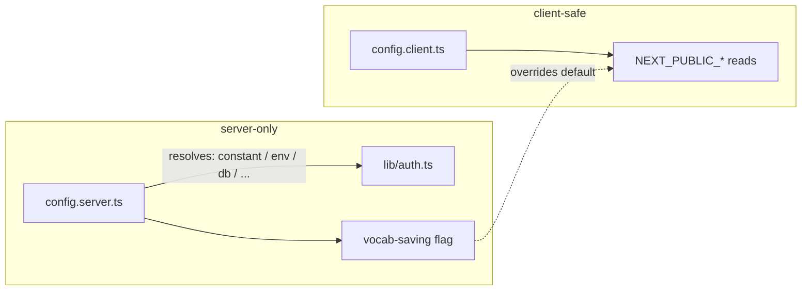

## Description

- **Problem:** env vars are read ad hoc via raw `process.env.X`, with no validation and no single
  place to see what's required. Concretely, [lib/auth.ts:53-54](../../src/lib/auth.ts#L53-L54) does
  `process.env.AUTH_GOOGLE_ID!` / `AUTH_GOOGLE_SECRET!` — a missing var isn't caught, it flows into
  a failed Google token request and surfaces later as a generic `RefreshTokenError`, not a clear
  "missing AUTH_GOOGLE_ID" error. There's also no single place to add a *new* piece of app config
  during development — today "where does this value come from" is decided per call site.
- **Goal:** one config module per side (server/client) that acts as a **facade** — each entry is
  declared once, with a default; how it's actually resolved (hardcoded constant today, `env` var,
  a DB row, or anything else later) is an internal detail of that module, never something call
  sites need to know or change when the source moves.
- **Different problem from [[task-018_unified-settings-management]]:** that task is per-user
  runtime preferences (localStorage, mutable, UI-exposable). This is app-wide/deployment config
  (fixed per environment, resolved once at server start / build). They share the same *shape*
  (declare once, provide a default, swap the source behind it) — worth noticing if that overlap
  ever becomes real duplication worth a shared primitive, but kept as two tasks for now since the
  mutability/UI dimension is genuinely different.

- **Approach (sketch — refine in Log):**
  - `src/config/config.server.ts` — server-only entries (`googleClientId`, `googleClientSecret`,
    `authUrl`, `authSecret`, `vocabSavingEnabled`); never imported from a client component. Each
    entry resolves however it needs to *today* — some may be a plain constant at first, others
    read from env via a small helper — without changing the module's public shape.
  - `src/config/config.client.ts` — client-safe entries, sourced from `NEXT_PUBLIC_*` only.
  - Two small resolution helpers used internally where env-backed: `requireEnv(name)` throws
    `Missing required env var: X`; `optionalEnv(name, fallback)` returns a typed default.
  - Migrate [lib/auth.ts](../../src/lib/auth.ts) and
    [vocabSavingFlag.ts](../../src/modules/vocab-store/vocabSavingFlag.ts) to read from the new
    modules; behaviour unchanged for valid config, but a missing required entry now fails loudly
    at the point of use instead of silently downstream.
- **Constraints:** no new dependency needed for this scope (hand-rolled helpers suffice); must not
  make client bundles fail on server-only entries (respect the `NEXT_PUBLIC_` boundary); existing
  `.env.local.example` stays the documentation of what's required vs optional for the entries that
  are in fact env-backed.

## Plan
- [x] Inventory current + near-term config entries — `AUTH_GOOGLE_ID`, `AUTH_GOOGLE_SECRET`,
      vocab-saving flag are read directly in our code; `AUTH_URL`/`AUTH_SECRET` are consumed
      internally by NextAuth itself, not read anywhere in our code, so no entry needed for them
- [x] Write `requireEnv` / `optionalEnv` helpers with clear thrown-error messages
- [x] Create `config.server.ts` + `config.client.ts`, each exporting a typed config object; every
      entry's resolution (constant / env / future source) lives inside the module, not at call sites
- [x] Migrate `lib/auth.ts` and the vocab-saving flag to read from the new modules
- [x] Verify: full test suite + `tsc --noEmit` + eslint clean; a unit test directly exercises the
      "unset a required entry → clear named error" behaviour end-to-end through `config.server`
      (a real `next build` in-sandbox isn't possible — no outbound internet for `next/font`'s
      Google Fonts fetch, unrelated to this change; confirmed by stashing these changes and
      re-running — same failure occurs unchanged)

## Done when

Every server-side config value needed for auth/config is read through `config.server.ts` — unset a
required one and you get a clear named error, not a downstream generic failure. Client-safe values
go through `config.client.ts`. Adding a new config entry during development means adding one line
to the relevant module, not deciding a fetch strategy at the call site. No behaviour change when
config is valid.

## Outputs
- [config.server.ts](../../src/config/config.server.ts) — server-only facade, keys named after the
  env var they represent (`config.AUTH_GOOGLE_ID`, `config.AUTH_GOOGLE_SECRET`,
  `config.VOCAB_SAVING_ENABLED`); plain object, resolved eagerly at import (fail-fast at startup).
- [config.client.ts](../../src/config/config.client.ts) — client-safe facade (`config.VOCAB_SAVING_ENABLED`
  from `NEXT_PUBLIC_*`); literal env member-expressions only, per Next.js's build-time inlining rule.
- [env.ts](../../src/config/env.ts) — `requireEnv`/`optionalEnv`, server-only dynamic env helpers.
- [booleanEnv.ts](../../src/config/booleanEnv.ts) — `parseBooleanEnv`, pure, shared by both sides.
- [env.test.ts](../../src/config/env.test.ts), [booleanEnv.test.ts](../../src/config/booleanEnv.test.ts),
  [config.server.test.ts](../../src/config/config.server.test.ts) — 10 `node:test` unit tests.
- [lib/auth.ts](../../src/lib/auth.ts) — reads `config.AUTH_GOOGLE_ID`/`config.AUTH_GOOGLE_SECRET`
  instead of `process.env.X!`.
- [saveVocab.ts](../../src/modules/vocab-store/saveVocab.ts) /
  [api/vocab/route.ts](../../src/app/api/vocab/route.ts) — read `config.VOCAB_SAVING_ENABLED`
  directly from `config.client`/`config.server` respectively; the intermediate
  `vocabSavingFlag.client.ts`/`.server.ts` wrapper files were removed once the flag simplified to
  a passthrough (see Log) — the config facade itself already provides the "swap the source later"
  indirection, so a second wrapper achieved nothing beyond a different function name.
- [README.md](../../README.md), [docs/setup-guide.md](../../docs/setup-guide.md),
  [.env.local.example](../../.env.local.example) — updated to drop the removed
  `VOCAB_SAVING_ENABLED` server override and the (now-deleted) `vocabSavingFlag.*` file references.

## Log
- 2026-07-18: Drafted [human + ai]. Motivated by a real gap in `lib/auth.ts`: `process.env.AUTH_GOOGLE_ID!`
  has no validation, so a missing var fails silently into a generic `RefreshTokenError`. Reframed
  from an "env-only" module to a config **facade**: entries can start as plain constants and move to
  env/DB/etc. later without call sites changing — human's explicit ask was "don't make the developer
  think about where a config value comes from." Renamed file/module from `env.*` to `config.*`
  accordingly. Kept deliberately separate from [[task-018_unified-settings-management]] (deployment
  config vs. per-user runtime preferences), though the two share the same declare-once/default/
  swappable-source shape.
- 2026-07-18: Implemented [ai]. Built `config.server.ts`/`config.client.ts` as getter-based facades
  (lazy — a required entry only throws on actual access, so no build/import-time crash risk) over
  small `requireEnv`/`optionalEnv` helpers, plus a pure `parseBooleanEnv` shared by both sides.
  Migrated `lib/auth.ts`'s two raw `process.env.X!` reads and both vocab-saving-flag functions onto
  the facade. **Found and fixed a real boundary risk while migrating**: the old `vocabSavingFlag.ts`
  held both the client and server functions in one file, and its client-reachable caller
  (`saveVocab.ts`, used from `TranslatableWord.tsx`/`SelectionTranslationPopup.tsx`) would have
  pulled `config.server.ts` into the client bundle graph alongside it — likely harmless in practice
  (lazy getters, unused export, probably tree-shaken) but not something to leave to chance on a
  module that reads OAuth secrets. Split into `vocabSavingFlag.client.ts` /
  `vocabSavingFlag.server.ts` so the server config module is never even importable from the client
  path. Also found imports need explicit `.ts` extensions internally (`./env.ts`, not `./env`) —
  Next.js's bundler tolerates the extensionless form but Node's native test runner doesn't; fixed
  to match the project's existing convention (see `deriveInflection.test.ts`).
  Verified: 24/24 tests pass (11 new + 13 existing), `tsc --noEmit` clean, targeted `eslint` clean
  on all changed files. `next build` couldn't be exercised in-sandbox (no outbound internet for
  `next/font`'s Google Fonts fetch) — confirmed this is pre-existing and unrelated by stashing the
  change and reproducing the identical failure. → in-review, awaiting human check.
- 2026-07-18: Revised on human feedback [human + ai]. Getters felt like unnecessary ceremony;
  switched both modules to plain eager objects keyed by the env var name itself
  (`config.AUTH_GOOGLE_ID`, `config.VOCAB_SAVING_ENABLED`) instead of camelCase getter properties.
  Trade-off called out and accepted: resolution now happens once at import instead of lazily on
  read — for `AUTH_GOOGLE_ID`/`AUTH_GOOGLE_SECRET`, both already-required secrets, that's a
  fail-fast-at-startup property, not a regression. Rewrote `config.server.test.ts` to import a
  fresh module instance per test (cache-busting query string) since eager values are now fixed at
  first import rather than re-read per access. Re-verified: 23/23 tests, `tsc --noEmit` clean,
  targeted `eslint` clean. Still in-review.
- 2026-07-18: Dropped `VOCAB_SAVING_ENABLED` (server override) entirely [human + ai]. Human
  question: given this app's actual deployment model (personal/local use via `npm run dev`,
  restart to change anything), does the dedicated server-only override — added in
  [[task-006_google-sheets-adapter]] to force-disable saving without a client rebuild — earn its
  keep? Agreed it doesn't: on this deployment model there's no meaningful difference between
  editing one env var vs. the other before a restart. `config.server.ts`'s `VOCAB_SAVING_ENABLED`
  now reads `NEXT_PUBLIC_VOCAB_SAVING_ENABLED` directly (single line, no fallback). Updated
  `README.md`, `docs/setup-guide.md`, `.env.local.example` to drop the removed var and a stale
  `vocabSavingFlag.ts` path reference (predates this task's client/server file split). Left a
  post-done note on `task-006` rather than reopening it. Re-verified: 23/23 tests, `tsc --noEmit`
  clean, targeted `eslint` clean. Still in-review.
- 2026-07-18: Removed `vocabSavingFlag.client.ts`/`.server.ts` entirely [human + ai]. Human
  question: now that `VOCAB_SAVING_ENABLED` is a plain passthrough on both sides, don't these
  wrapper files add nothing? Correct — `config.server.ts`/`config.client.ts` already are the
  "swap the source later without callers knowing" facade; wrapping a facade in a same-shaped
  function achieves nothing but a different name. Only two callers existed (`saveVocab.ts`,
  `api/vocab/route.ts`); both now read `config.VOCAB_SAVING_ENABLED` directly from the correct
  side's config module — no change to the client/server boundary safety established earlier,
  since each caller still only ever imports the config module matching its own side. Updated the
  doc reference in `docs/setup-guide.md` that pointed at the now-deleted files. Re-verified:
  23/23 tests, `tsc --noEmit` clean, targeted `eslint` clean. Still in-review.
