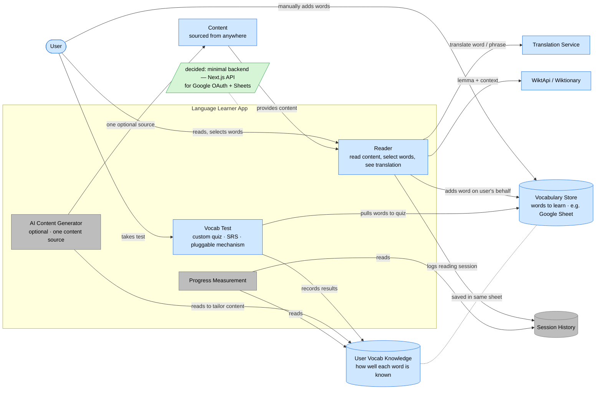

```mermaid
flowchart LR
    user([User])

    subgraph app[Language Learner App]
        reader[Reader<br/>read content, select words, see translation]
        aigen[AI Content Generator<br/>optional · one content source]
        test[Vocab Test<br/>custom quiz · SRS · pluggable mechanism]
        progress[Progress Measurement]
    end

    content[Content<br/>sourced from anywhere]
    translate[Translation Service]
    wikt[WiktApi / Wiktionary]
    vocab[(Vocabulary Store<br/>words to learn · e.g. Google Sheet)]
    knowledge[(User Vocab Knowledge<br/>how well each word is known)]
    sessions[(Session History)]

    %% --- core loop: read -> update knowledge -> repeat (content from anywhere) ---
    user -->|reads, selects words| reader
    user -->|manually adds words| vocab
    user -->|takes test| test

    content -->|provides content| reader
    reader -->|translate word / phrase| translate
    reader -->|lemma + context| wikt
    reader -->|adds word on user's behalf| vocab

    test -->|pulls words to quiz| vocab
    test -->|records results| knowledge

    %% knowledge persists in the same sheet as the vocabulary store
    knowledge -. saved in same sheet .- vocab

    %% --- later / not in initial release ---
    aigen -->|one optional source| content
    aigen -->|reads to tailor content| knowledge
    reader -->|logs reading session| sessions
    progress -->|reads| knowledge
    progress -->|reads| sessions

    %% --- resolved decisions ---
    d1[/"decided: minimal backend — Next.js API<br/>for Google OAuth + Sheets"/]
    d1 -.- app

    %% --- styling ---
    classDef initial fill:#cfe8ff,stroke:#1f6feb,color:#000;
    classDef later fill:#bdbdbd,stroke:#7a7a7a,color:#000;
    classDef decided fill:#d6f5d6,stroke:#2da44e,color:#000;

    class user,reader,content,test,translate,wikt,vocab,knowledge initial;
    class aigen,progress,sessions later;
    class d1 decided;
```
